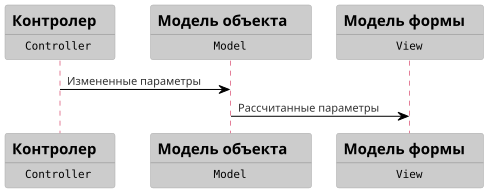
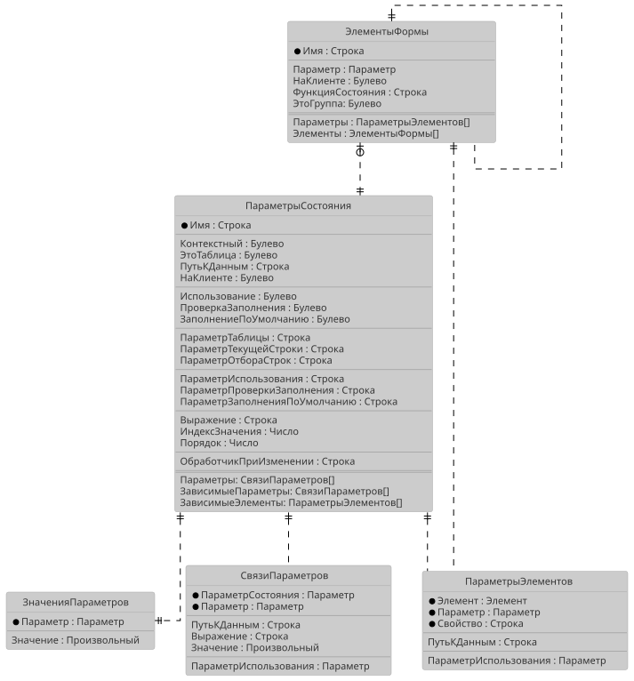
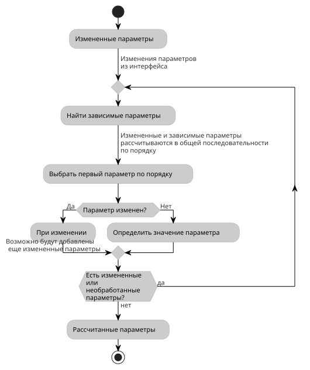
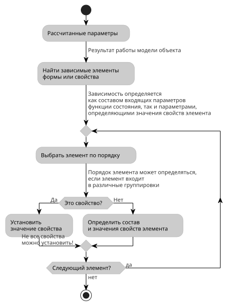

# Reactive Declarative UI State Model

[](https://openyellow.org/grid?filter=top&repo=500127451)

**Модель состояния** — подсистема [KASL](https://github.com/KalyakinAG/kasl) для описания зависимостей данных и поведения управляемых форм на языке 1С. Разработчик объявляет, **от чего зависит значение и как его вычислить**, а механизм определяет порядок пересчёта и обновляет связанные свойства интерфейса.

Подход **Reactive Declarative State Model** позволяет собрать правила расчёта вокруг параметров состояния, вместо того чтобы распределять их по обработчикам событий. Одна общая модель может использоваться и в форме, и при программном заполнении объекта без интерфейса.

[](https://infostart.ru/1c/articles/2794694/)

> Описание API и примеры в README ориентированы на актуальный проект `KASL-demo-ssl`. При использовании отдельных сборок учитывайте их версию: исходники и бинарные файлы этого репозитория могут обновляться отдельно от демо-проекта.

## Содержание

- [Возможности](#возможности)
- [Как это работает](#как-это-работает)
- [Быстрый старт: расчёт без формы](#быстрый-старт-расчёт-без-формы)
- [Основные понятия и DSL](#основные-понятия-и-dsl)
- [Общая модель документа](#общая-модель-документа)
- [Модель формы](#модель-формы)
- [Работа с таблицами](#работа-с-таблицами)
- [Подключение к форме](#подключение-к-форме)
- [Обработчики и вычисляемые параметры](#обработчики-и-вычисляемые-параметры)
- [Состав подсистемы](#состав-подсистемы)
- [Установка и зависимости](#установка-и-зависимости)
- [Демонстрационные примеры](#демонстрационные-примеры)
- [Диаграммы](#диаграммы)

## Возможности

- **Зависимые значения.** Расчёт сумм, курсовых пересчётов, полей строк таблиц и вспомогательных признаков по графу зависимостей.
- **Согласованность данных.** Проверка ссылочного значения по условиям отбора, очистка неподходящего значения и автоматический выбор единственного подходящего варианта.
- **Декларативный интерфейс.** Заголовки, видимость, режим просмотра, отбор строк и другие поддерживаемые свойства элементов определяются параметрами модели.
- **Параметры выбора.** Связи данных используются и при расчёте, и для настройки выбора в полях формы.
- **Работа с таблицами.** Текущая строка как параметр состояния, зависимости от таблицы целиком, ключи строк, общие обработчики редактирования и отмены.
- **Клиент-серверный расчёт.** Простые правила могут выполняться на клиенте; при необходимости расчёт продолжается на сервере.
- **Повторное использование.** Общее описание документа применяется в интерфейсе и при заполнении по шаблону без открытия формы.

## Как это работает

1. **Описать модель:** параметры состояния, входящие связи, условия использования и выражения.
2. **Применить модель:** подготовить схему и порядок расчёта по графу зависимостей, а для формы — подключить свободные обработчики и настройки выбора.
3. **Передать изменения:** из события формы либо программно через шаблон заполнения.
4. **Пересчитать зависимости:** обработать затронутые параметры в установленном порядке.
5. **Обновить форму:** применить свойства, связанные с рассчитанными параметрами. Для сценария без интерфейса этот шаг не нужен.

Разделение ответственности можно сопоставить с MVC:

| Роль | За что отвечает |
| --- | --- |
| Модель | Зависимости данных, правила расчёта и прикладные обработчики |
| Представление | Элементы формы и декларация их свойств |
| Контроллер | Передача изменений в модель, продолжение расчёта на сервере и обновление формы |

При этом сама форма также моделируется: её заголовок, видимость полей и текущая строка входят в описание состояния. Общая модель документа содержит правила данных, а модель формы дополняет её правилами взаимодействия с пользователем.

**Реактивность требует передачи изменений модели.** Обычное присваивание реквизиту в программном коде само по себе не запускает пересчёт зависимостей. Используйте заполнение через модель или явную регистрацию изменений.

**Согласованность и заполненность — разные свойства.** Например, после смены контрагента прежний договор может очиститься: данные больше не противоречат друг другу, но документ ещё не готов к записи. Проверка обязательных полей остаётся отдельным шагом.

## Быстрый старт: расчёт без формы

Пример выполняется **на сервере** в конфигурации с установленной подсистемой и её зависимостями. Контекстом служит обычная структура; поле `ДополнительныеСвойства` используется для служебных данных модели.

```bsl
Объект = Новый Структура;
Объект.Вставить("Цена", 0);
Объект.Вставить("Количество", 0);
Объект.Вставить("Сумма", 0);
Объект.Вставить("ДополнительныеСвойства", Новый Структура);

РаботаСМодельюСостояния.НоваяМодельСостояния(Объект)
	.ПараметрСостояния("Сумма")
		.Параметр("Цена")
		.Параметр("Количество")
		.Выражение("Параметры.Цена * Параметры.Количество")
	.ПрименитьМодель()
;

ШаблонОбъекта = Новый Структура("Цена, Количество", 10, 2);
РаботаСОбъектом.ЗаполнитьИРассчитать(Объект, ШаблонОбъекта);

Сообщить(Объект.Сумма); // 20

// Повторный расчёт по той же модели: передаём только изменившееся поле.
РаботаСОбъектом.ЗаполнитьИРассчитать(
	Объект, Новый Структура("Количество", 3));

Сообщить(Объект.Сумма); // 30
```

Сумма не записывается в шаблон: модель вычисляет её по объявленным зависимостям. Порядок присваиваний цены и количества не требуется согласовывать с порядком расчёта суммы.

Если нужно получить результат расчёта для дальнейшей обработки, заполнение и расчёт можно выполнить отдельно:

```bsl
ИзмененныеПараметры = РаботаСОбъектомКлиентСервер.Заполнить(
	Объект, Новый Структура("Цена", 15));
СостояниеРасчета = РаботаСОбъектомКлиентСервер.Рассчитать(
	Объект, ИзмененныеПараметры);
```

## Основные понятия и DSL

**Параметр состояния** представляет реквизит объекта, таблицу целиком, поле строки или вспомогательное значение. **Связь** задаёт входную зависимость. **Выражение** определяет способ получения результата. **Элемент формы** связывает параметры со свойствами интерфейса.

Конструктор модели:

```bsl
МодельСостояния = РаботаСМодельюСостояния.НоваяМодельСостояния(
	Контекст, ПутьКДаннымОбъекта, МодульМодели);
```

- `Контекст` — форма или моделируемый объект.
- `ПутьКДаннымОбъекта` — путь к основному объекту внутри контекста. Если аргумент пропущен и у формы есть реквизит `Объект`, он определяется автоматически.
- `МодульМодели` — имя модуля прикладных обработчиков; по умолчанию используется `Контекст`.

Пути параметров указываются относительно основного объекта: `СуммаДокумента`, `Товары.Сумма`, без префикса `Объект`. Контекстные параметры относятся к внешнему контексту, а не к основному объекту.

| Метод DSL | Назначение |
| --- | --- |
| `ПараметрСостояния("Сумма")` | Создать или выбрать параметр состояния |
| `Параметр("Цена")` | Объявить зависимость от другого параметра |
| `Параметр("Отбор.Владелец", "Контрагент")` | Передать значение источника под заданным именем во входные параметры |
| `Значение("Отбор.НомерДоговора", "144")` | Задать постоянное входное значение |
| `Выражение("...")` | Определить формулу; входные значения доступны через `Параметры` |
| `ТипБулево()` | Задать логический тип и разрешить незаполненное в терминах платформы значение `Ложь` |
| `Использование(...)`, `НеИспользование(...)` | Задать условие использования параметра или связи |
| `ПроверкаЗаполнения(Ложь)` | Разрешить пустое значение параметра или входной зависимости |
| `НаКлиенте()`, `НаСервере()` | Задать контекст исполнения расчёта |
| `Слабая()` | Ослабить ограничение интерактивного выбора, сохранив расчётную зависимость |
| `ЭлементФормы("Имя")` | Выбрать элемент; без аргумента — саму форму |
| `Свойство("Видимость")` | Описать рассчитываемое свойство элемента |
| `Свойство("Видимость", "ЭтоВнешняяОперация")` | Связать свойство с готовым параметром модели |
| `ТекущаяСтрока()` | Включить текущую строку таблицы в модель |
| `Ключ("Поле1, Поле2")` | Задать ключ строки для проверки повторов |
| `ПриИзменении()`, `ФункцияСостояния()` | Подключить прикладной обработчик |
| `ОбработчикИнициализацииДанных()` | Подключить подготовку данных при применении модели |
| `ПрименитьМодель()` | Завершить описание и применить его к контексту |

DSL позиционный: `Использование` после `ПараметрСостояния` относится к параметру, а после `Параметр` — к выбранной связи. Порядок описания правил не заменяет граф зависимостей: все используемые входные параметры нужно объявлять явно.

## Общая модель документа

В `KASL-demo-ssl` общая модель документа `_ДемоЗаявкаНаОперацию` описана функцией `МодельСостояния(Контекст)` в модуле менеджера. Прикладные обработчики размещены в `_ДемоЗаявкаНаОперациюМодель`. Функция возвращает описание, которое можно дополнить перед применением.

### Расчёт суммы

Фрагмент общей модели заявки:

```bsl
МодельСостояния.ПараметрСостояния("СуммаДокумента").НаКлиенте()
	.Параметр("СуммаВзаиморасчетов")
	.Параметр("КурсРасчетов")
	.Выражение("Параметры.СуммаВзаиморасчетов * Параметры.КурсРасчетов")
;
```

Изменение суммы взаиморасчётов или курса запускает пересчёт суммы документа. Формула используется и при работе с формой, и при заполнении объекта без интерфейса.

### Подбор ссылочного значения

```bsl
МодельСостояния.ПараметрСостояния("ДоговорКонтрагента")
	.НеИспользование("ЭтоРасчетыБезДоговора")
	.Параметр("Отбор.Организация", "Организация")
	.Параметр("Отбор.Владелец", "Контрагент")
;
```

В полной модели признак `ЭтоРасчетыБезДоговора` определяется по виду операции. Договор используется, когда этот признак ложен. Связи формируют структуру `Параметры.Отбор`: организация и владелец становятся условиями проверки и подбора договора.

Для ссылочного параметра без собственного выражения подсистема проверяет текущее значение по условиям. Неподходящее значение очищается; если разрешено заполнение по умолчанию, пустое значение заполняется при единственном подходящем варианте. На форме эти же связи настраивают выбор.

Условия можно задавать и для отдельных связей. Например, упрощённое правило выбора владельца счёта для двух взаимоисключающих видов операций:

```bsl
МодельСостояния.ПараметрСостояния("СчетКонтрагента")
	.Параметр("Отбор.Владелец", "Организация")
		.Использование("ЭтоВнутренняяОперация")
	.Параметр("Отбор.Владелец", "Контрагент")
		.Использование("ЭтоВнешняяОперация")
;
```

Признаки операций должны быть описаны в модели. В полном демо дополнительно учитываются форма оплаты и внутригрупповые операции.

### Заполнение без интерфейса

В модуле объекта документа общая модель применяется к `ЭтотОбъект`, а исходные значения передаются через шаблон. Например, сокращённый сценарий расчёта суммы:

```bsl
Документы._ДемоЗаявкаНаОперацию.МодельСостояния(ЭтотОбъект).ПрименитьМодель();

ШаблонОбъекта = Новый Структура;
ШаблонОбъекта.Вставить("КурсРасчетов", 1);
ШаблонОбъекта.Вставить("СуммаВзаиморасчетов", 100);
РаботаСОбъектом.ЗаполнитьИРассчитать(ЭтотОбъект, ШаблонОбъекта);
```

Полный пример находится в `ОбработкаЗаполнения` демо-документа и дополнительно задаёт вид операции, форму оплаты и направление движения. По тому же принципу можно организовать расчёт при загрузке данных или в фоновом задании: общая модель и её обработчики должны работать без контекста формы.

## Модель формы

Форма получает общую модель документа и дополняет её правилами интерфейса. Ниже — сокращённый фрагмент для формы демо-заявки с уже существующими реквизитами и элементами:

```bsl
МодельСостояния = Документы._ДемоЗаявкаНаОперацию.МодельСостояния(ЭтотОбъект);

МодельСостояния.ЭлементФормы()
	.Свойство("Заголовок")
		.Параметр("Номер")
		.Параметр("Дата")
		.Выражение("СтрШаблон('Заявка на операцию %1 от %2', Параметры.Номер, Параметры.Дата)")
	.Свойство("ТолькоПросмотр")
		.Параметр("Проведен")
		.Выражение("Параметры.Проведен")
;

МодельСостояния.ЭлементФормы("СуммаВзаиморасчетов")
	.Свойство("Видимость")
		.Параметр("ВалютаВзаиморасчетов")
		.Параметр("ВалютаДокумента")
		.Выражение("Параметры.ВалютаВзаиморасчетов <> Параметры.ВалютаДокумента")
;

МодельСостояния.ПрименитьМодель();
ОбновитьФормуНаСервере();
```

`ОбновитьФормуНаСервере` — служебная процедура модуля формы из демонстрационного шаблона. Внутри она вызывает `РаботаСФормойКлиентСервер.ОбновитьФорму`.

Программные изменения также передаются через модель. Фрагмент серверной процедуры подключённой формы:

```bsl
ШаблонОбъекта = Новый Структура("Дата, Номер", ТекущаяДатаСеанса(), "00001");
ИзмененныеПараметры = РаботаСОбъектомКлиентСервер.Заполнить(ЭтотОбъект, ШаблонОбъекта);
ПриИзмененииНаСервере(ИзмененныеПараметры);
```

Служебная процедура `ПриИзмененииНаСервере` рассчитывает модель и передаёт `СостояниеРасчета.РассчитанныеПараметры` в обновление формы. Список **изменённых** исходных параметров и список **рассчитанных** параметров выполняют разные задачи.

## Работа с таблицами

Модель различает таблицу целиком и поля её строк. Например, для объекта с таблицей `Товары` и реквизитом `СуммаДокумента` можно описать:

```bsl
МодельСостояния.ПараметрСостояния("Товары.Сумма")
	.Параметр("Цена", "Товары.Цена")
	.Параметр("Количество", "Товары.Количество")
	.Выражение("Параметры.Цена * Параметры.Количество")
;

МодельСостояния.ПараметрСостояния("СуммаДокумента")
	.Параметр("Товары").ПроверкаЗаполнения(Ложь)
	.Выражение("Параметры.Товары.Итог('Сумма')")
;
```

Первая формула работает с полями конкретной строки, вторая — с итогом таблицы. Отключение проверки заполнения входной таблицы позволяет получить нулевой итог для пустой коллекции.

### Текущая строка и связанные элементы

Вызов `ТекущаяСтрока()` создаёт параметр `Таблицы.<ИмяТаблицы>.ТекущаяСтрока`. Его значением служит идентификатор строки данных формы. Пример для таблицы `Товары` и надписи `ЦенаНоменклатуры`:

```bsl
МодельСостояния.ЭлементФормы("Товары")
	.ТекущаяСтрока()
;

МодельСостояния.ЭлементФормы("ЦенаНоменклатуры")
	.Свойство("Заголовок")
		.Параметр("Товары")
		.Параметр("Таблицы.Товары.ТекущаяСтрока")
		.Выражение("?(Параметры.Таблицы.Товары.ТекущаяСтрока = Неопределено, '-',
		| СтрШаблон('Цена: %1', Параметры.Товары.НайтиПоИдентификатору(
		| Параметры.Таблицы.Товары.ТекущаяСтрока).Цена))")
;
```

Зависимость от текущей строки обновляет надпись при переходе между строками, а зависимость от таблицы — при изменении её данных. Аналогично можно вычислять свойство `ОтборСтрок` подчинённой таблицы.

### Редактирование и заполнение строк

- При редактировании существующей строки механизм сохраняет её состояние и восстанавливает значения при отмене. Это транзакционность на уровне формы, а не транзакция базы данных.
- Изменение отдельного поля может запускать расчёт ещё во время ввода. После подтверждения редактирования механизм регистрирует изменение таблицы и запускает отложенный пересчёт. Для итогов и других правил, зависящих от принятого состояния строк, объявляйте зависимость от таблицы целиком.
- В текущей реализации обработчик отмены восстанавливает строку и завершается без постановки таблицы в очередь отложенного расчёта. Одна лишь зависимость от таблицы не гарантирует пересчёт после отмены: этот сценарий требует отдельного уведомления модели об изменении таблицы.
- При заданном `Ключ` обработчик завершения редактирования проверяет заполнение используемых обязательных полей и отсутствие повторов ключа. В дереве повторы проверяются среди строк одного родителя.
- В шаблоне заполнения `ИдентификаторСтроки` адресует существующую строку. Для обычной `ТаблицаЗначений` это индекс с нуля, для данных формы — идентификатор строки. Шаблон без идентификаторов используется для перезаполнения таблицы.
- `ОтборСтрок` управляет отображением; автоматическое заполнение новой строки значениями отбора относится к планируемому развитию.

## Подключение к форме

В качестве образца используйте модуль `Documents/_ДемоЗаявкаНаОперацию/Forms/ФормаДокумента/Module.bsl` проекта `KASL-demo-ssl`.

1. **Перенесите служебный код** из областей `ОбработчикиСобытийФормыВМоделиСостояния` и, при наличии таблиц, `ОбработчикиСобытийТаблицыФормыВМоделиСостояния`. Добавьте клиентские экспортные переменные `ОтложенныеПараметры` и `СостояниеТаблицыФормы`. Процедура `РассчитатьОтложенныеПараметры` должна оставаться экспортной.
2. **Подготовьте прикладные реквизиты и элементы.** Они должны существовать до применения модели. Служебные реквизиты схемы подсистема добавляет сама.
3. **Опишите модель** в серверной процедуре `ПрименитьМодельСостояния`: получите общую модель документа или создайте новую, добавьте правила формы и вызовите `ПрименитьМодель()`.
4. **В `ПриСозданииНаСервере`** вызовите `ПрименитьМодельСостояния()`, затем `ОбновитьФормуНаСервере()`.
5. **Согласуйте существующие обработчики.** Подсистема назначает обработчик только свободному событию. Если обработчик уже есть, добавьте в него соответствующий вызов служебного кода.
6. **Подключите программные изменения** через `Заполнить` и процедуры расчёта с обновлением формы.

Основные вызовы из существующих обработчиков:

| Событие | Вызов служебной процедуры формы |
| --- | --- |
| `ПриОткрытии` | `ПриОткрытииВМоделиФормы(Отказ)` |
| `ПриЧтенииНаСервере` | `ПриЧтенииВМоделиФормыНаСервере(ТекущийОбъект)` |
| `ПослеЗаписиНаСервере` | `ПослеЗаписиВМоделиФормыНаСервере(ТекущийОбъект, ПараметрыЗаписи)` |
| `ПриИзменении` поля | `ПриИзменении(Элемент)` |
| `НачалоВыбора` поля | `НачалоВыбора(Элемент, ДанныеВыбора, СтандартнаяОбработка)` |

Для таблиц также подключаются выбор и активизация строки, добавление, начало и окончание редактирования, проверки перед завершением и удалением. Полный набор процедур и их сигнатуры приведены в указанном модуле демо. Если имя существующего обработчика совпадает с именем служебной процедуры, объедините их тела, избегая вызова процедуры из неё самой.

Автоматическое подключение означает назначение имён уже существующих процедур событиям. Подсистема не генерирует тела обработчиков в модуле формы. Для чтения и записи объектов со ссылкой в модуле модели нужна экспортная процедура `ИнициализироватьДанные`: общий обработчик чтения вызывает её для подготовки контекста.

После подключения проверьте открытие нового и существующего объекта, изменение исходных реквизитов, выбор ссылок, переход расчёта на сервер и программное заполнение. Для таблиц дополнительно проверьте смену текущей строки, добавление, подтверждение, отмену и удаление.

## Обработчики и вычисляемые параметры

### Прикладные обработчики

Короткое правило удобно задать выражением; сложный алгоритм можно вынести в модуль, переданный конструктору модели.

| Объявление | Обработчик по умолчанию |
| --- | --- |
| `Выражение()` или `Выражение("*")` | `ЗначениеПараметра<Имя>(Параметры, Значение, СтандартнаяОбработка, Отказ)` |
| `ПриИзменении()` | `ПриИзмененииПараметра<Имя>(МодельОбъекта, РасчетныйПараметр)` |
| `ФункцияСостояния()` | `СвойстваЭлемента<Имя>(Свойства, Параметры)` |
| `ОбработчикИнициализацииДанных()` | `ИнициализироватьДанные(Схема)` |

В именах обработчиков параметров точки удаляются: `ДвиженияОперации.СтатьяДДС` превращается в `ПриИзмененииПараметраДвиженияОперацииСтатьяДДС`. Методы `Выражение`, `ПриИзменении` и `ФункцияСостояния` также принимают явную строку вызова.

Обработчик `ПриИзменении` модели выполняется в ходе расчёта; это не событие поля формы. Дополнительные изменения из него также нужно регистрировать в модели. Обработчик инициализации должен допускать повторный вызов, в том числе после чтения или записи объекта.

### Вычисляемые параметры

Признак `Вычисляемый` означает получение значения по запросу без отдельного сохранения результата в модели. Наличие формулы само по себе не делает параметр вычисляемым: например, рассчитанная сумма сохраняется в реквизите объекта.

DSL автоматически создаёт вычисляемые параметры для свойств формы, кроме `Заголовок`, а также для некоторых вспомогательных условий строк таблиц. Если свойство связано с уже существующим параметром, сохраняется его прежний признак. Такие выражения должны быть без побочных действий: повторное обращение может снова запустить вычисление. Зависимости при этом всё равно необходимо объявлять.

## Состав подсистемы

В `KASL-demo-ssl` ядро находится в подсистеме `KASL → Модели → МодельСостояния` и включает восемь объектов:

| Объекты | Назначение |
| --- | --- |
| `РаботаСМодельюСостояния`, `РаботаСМодельюСостоянияКлиентСервер` | Создание схемы, параметров и связей; применение модели |
| Обработка `МодельСостояния` | DSL — цепочки вызовов для описания данных и интерфейса |
| `РаботаСОбъектом`, `РаботаСОбъектомКлиентСервер` | Заполнение, регистрация изменений и расчёт параметров |
| `РаботаСФормой`, `РаботаСФормойКлиент`, `РаботаСФормойКлиентСервер` | Настройки выбора, события формы и таблиц, обновление интерфейса |

Демонстрационные объекты находятся отдельно, в `KASLДемо → _ДемоМодельСостояния`. Они показывают применение механизма и используют прикладные справочники демо-базы.

## Установка и зависимости

Актуальное демо разрабатывается на платформе **1С:Предприятие 8.3.27**, на основе БСП. Это ориентир для воспроизведения примеров, а не заявление о минимальной поддерживаемой версии платформы.

Зависимости подсистемы:

- Библиотека стандартных подсистем (БСП).
- [KASL — ОбщегоНазначения](https://github.com/KalyakinAG/common).
- [KASL — ВыборДанных](https://github.com/KalyakinAG/data-selection).
- [KASL — ПроверкаЗаполнения](https://github.com/KalyakinAG/data-validation).
- [KASL — АТДМассив](https://github.com/KalyakinAG/adt-array).

### Варианты подключения

1. **Из актуальной демо-конфигурации.** Выполните сравнение и объединение с приоритетом файла. Выберите по подсистемам `KASL → Модели → МодельСостояния` и её зависимости. После переноса подключите модель к нужным формам.
2. **Из отдельных проектов KASL.** Используйте CF для объединения либо CFE для установки расширений подсистем вместе с зависимостями. Учитывайте зависимости самих подключаемых проектов.
3. **Из общей сборки [KASL](https://github.com/KalyakinAG/kasl).** Установите сборку подсистем в виде одного расширения.

В репозитории доступны [StateModel.cf](bin/StateModel.cf), [StateModel.cfe](bin/StateModel.cfe) и [выгрузка демо-базы](bin/state-model-demo.dt).

Расширение `formhelper` требуется для примеров, которые программно строят тестовые формы в консоли демо. При описании модели для уже существующей формы построитель форм не нужен.

## Демонстрационные примеры

| Объект в `KASL-demo-ssl` | Что показывает |
| --- | --- |
| `_ДемоМодельСостояния`, форма `Консоль` | Выполнение текстовых макетов, построение тестовой формы и применение модели |
| Документ `_ДемоЗаявкаНаОперацию` | Общая модель документа, заполнение без формы, зависимые ссылки, валюты, суммы и аналитики строк |
| Обработка `ЗвездныйРейтинг` | Заголовок и видимость звёзд по одному параметру; нажатие → изменение рейтинга → обновление интерфейса |

В консоли модели состояния доступны макеты:

- `СвязиПараметровВыбора` — выбор договора по организации и контрагенту.
- `КонтекстныеПараметрыСостояния` — промежуточные признаки и видимость группы.
- `СвойстваФормы` — заголовок и режим просмотра.
- `ИзменениеСостоянияФормы` — заполнение по шаблону и обновление интерфейса.
- `ФормаСТабличнойЧастью` — расчёт строк, заголовки страниц и текущая строка.
- `ПодчиненнаяТаблица` — отбор движений по выбранному товару.

Для запуска выберите макет в форме `Консоль` обработки `_ДемоМодельСостояния` и примените модель. Примеры с договорами, видами операций и статьями ДДС используют данные демонстрационной базы.

## Диаграммы

Диаграммы поясняют архитектуру и общую последовательность обработки. Схема данных является обзорной; точный состав полей и сигнатуры API определяются актуальной реализацией `KASL-demo-ssl`.

### Передача изменений между слоями

Контроллер передаёт изменённые параметры модели объекта, а результат расчёта используется для обновления формы.



### Модель данных

Основные сущности: параметры состояния, связи, значения, элементы формы и привязки их свойств.



### Цикл расчёта параметров

Механизм находит зависимые параметры, обрабатывает их в установленном порядке и учитывает изменения, добавленные прикладными обработчиками.



### Обновление элементов формы

Рассчитанные параметры определяют, какие связанные свойства и функции состояния элементов нужно применить.



## Лицензия

[MIT](LICENSE).
